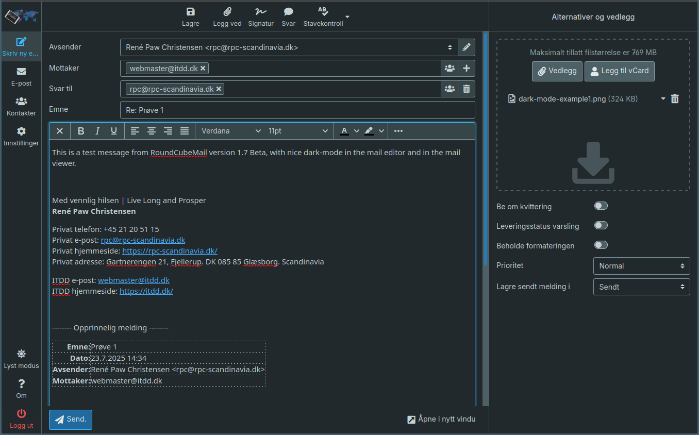
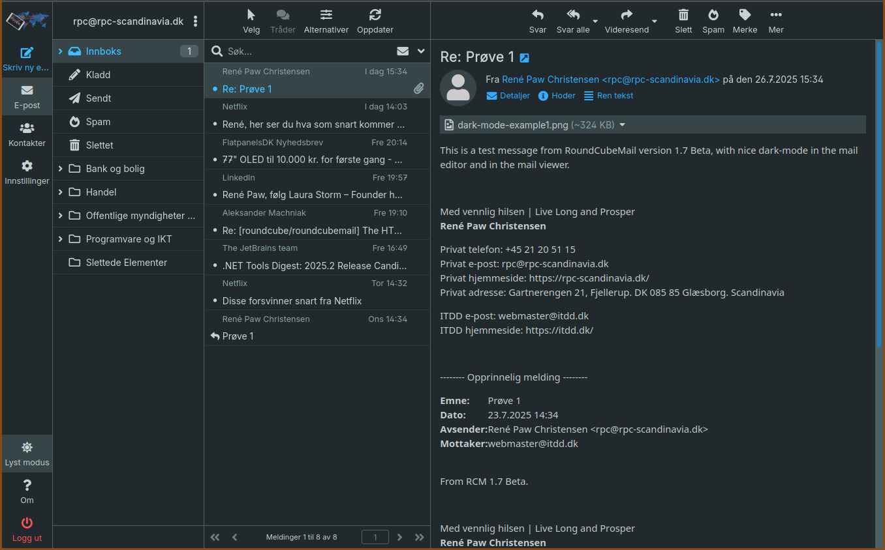
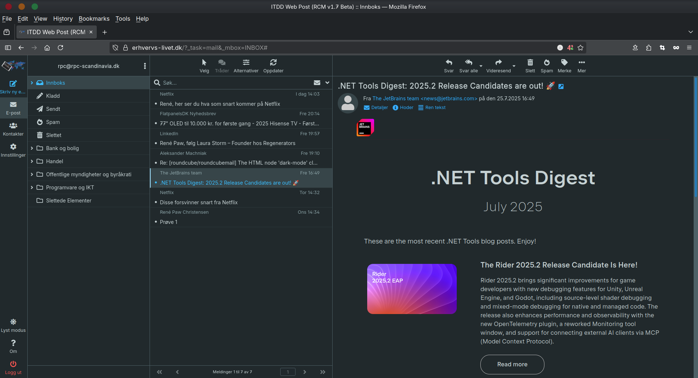
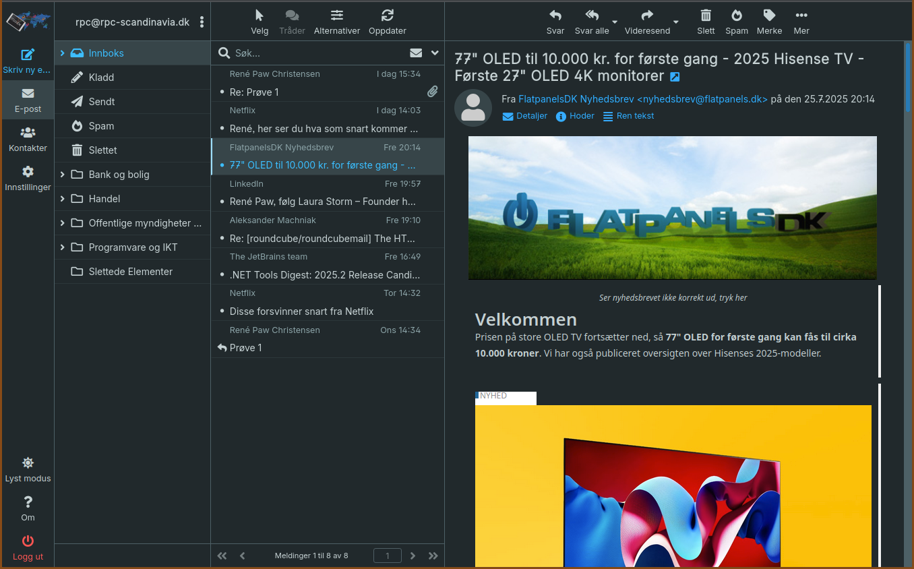
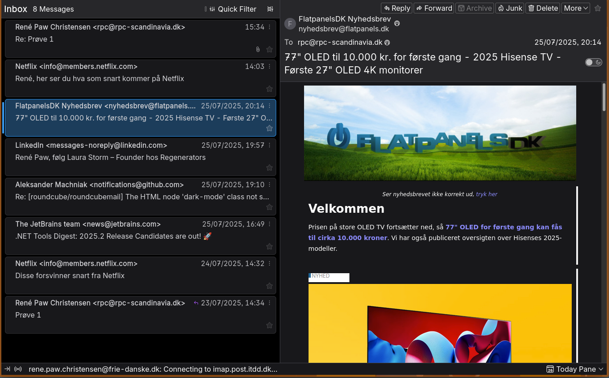

# RPC RoundCubeMail Patches
This plugin for RoundCubeMail version 1.7, patches dark mode for the mail editor and the mail viewer.
I think the quality is close to what you get in **Thunderbird**.

It also includes a customized version of the Inter font made by Rasmus Andersson from Scandinavia, released under SIL Open Font License version 1.1.\
https://github.com/rsms/inter/  and  https://rsms.me/inter/

It extends the mail editor dark mode work done by Dhiego Cassiano Fogaça Barbosa, which is released under Apache License version 2.0.\
https://github.com/modscleo4/roundcube-plugin-dark-html

## Inter font
The configurable option `use_scandinavian_inter_font` lets you choose whether to use the modified Inter font.

| Value  | Description                                                                  |
|--------|------------------------------------------------------------------------------|
| yes    | Use the Scandinavian Inter font in both the mail viewer and the mail editor. |
| viewer | Use the Scandinavian Inter font in the mail viewer.                          |
| editor | Use the Scandinavian Inter font in the mail editor.                          |
|        | Any other value will disable use of the Scandinavian Inter font.             |

When used in the mail editor, the Inter font is added to the `available_fonts` option and set as default in the `default_font` option.

A note about custom fonts in the message editor. Even though the font is available in the message **css**, the `@font face` is most likely stripped by the receiving mail servers with the result that the message receiver will see an alternative font unless the message receiver has an `inter` font installed, in which case the message receiver should see the Inter font though not the Scandinavian version.

## Dark mode prerequisites
This plugin assumes that RCM adds and removes the `dark-mode` class on the `html` element, specifying whether **dark mode** is enabled or not:

* For the web program itself
* For the mail viewer `iframe`
* For the mail viewer `window` or `tab`
* For the mail editor `iframe` (TinyMCE)

## Mail viewer
The configurable option `invert_implementation` lets you choose which **inverting** implementation to use.

| Value   | Description                                              |
|---------|----------------------------------------------------------|
| classic | The initial implementation (see examples below).         |
| colour  | An alternative implementation that retains more colours. |

I am still playing with the `colour` implementation.

### Known bugs
Minor: Sometimes there is a white flash when a mail is selected, but I think that I have found all the relevant **css** that can cause this.

I am inclined not to view this as a bug, because it looks like this is coming from white or bright background in the message itself, and the flash is caused by the delay between loading the message and the plugin inverting the message HTML elements. 

Minor: Not all the **css** and **js** is minified.

## Mail editor (TinyMCE)
RCM does not set the `dark-mode` class on the `html` element when the mail editor is created/initialised, the plugin fixes that.

RCM does however set the `dark-mode` class on the `html` element when the user toggles between **dark** and **light** mode.

### Fix **css**
The message editor **css** is fixed by creating a new **css** file containing the existing **css** from `skins/elastic/styles/embed.min.css` and some additional **css**. The RCM configuration setting `editor_css_location` is set with the path to the new combined **css** file, which causes RCM to use that file when it initialises the mail editor (TinyMCE).

### Known bugs
Minor: Not all the **css** is minified.

## File permissions
Because files are written, the following file permissions are required:

```sh
chmod  u+w  plugins/rpc_rcm_patches/skin/elastic
```

## Examples

### Message editor


### Message viewer



#### The same message in RoundCubeMail and Thunderbird




René Paw Christensen\
https://rpc-scandinavia.dk/
